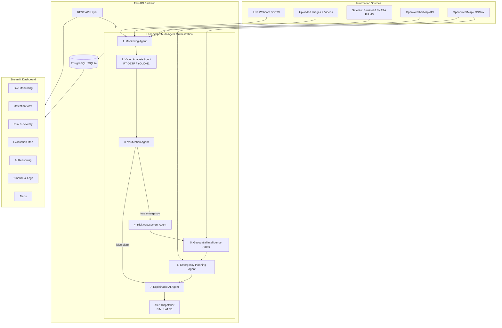
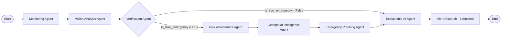
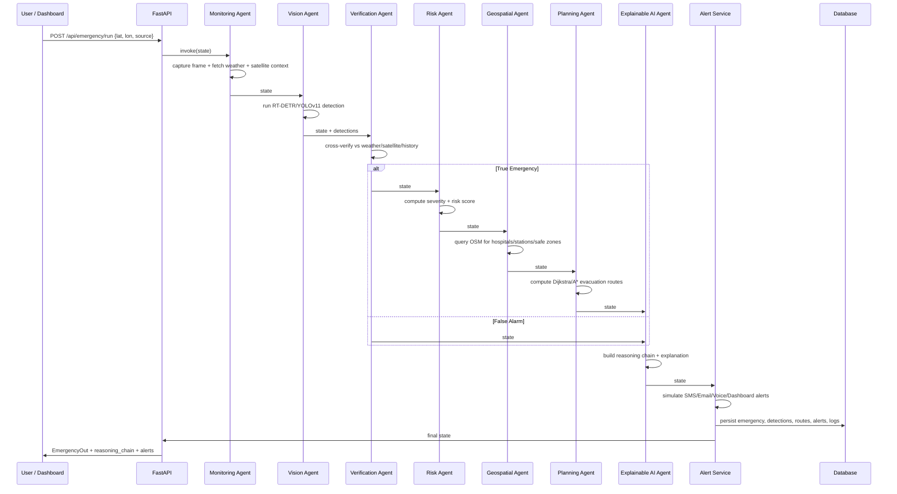
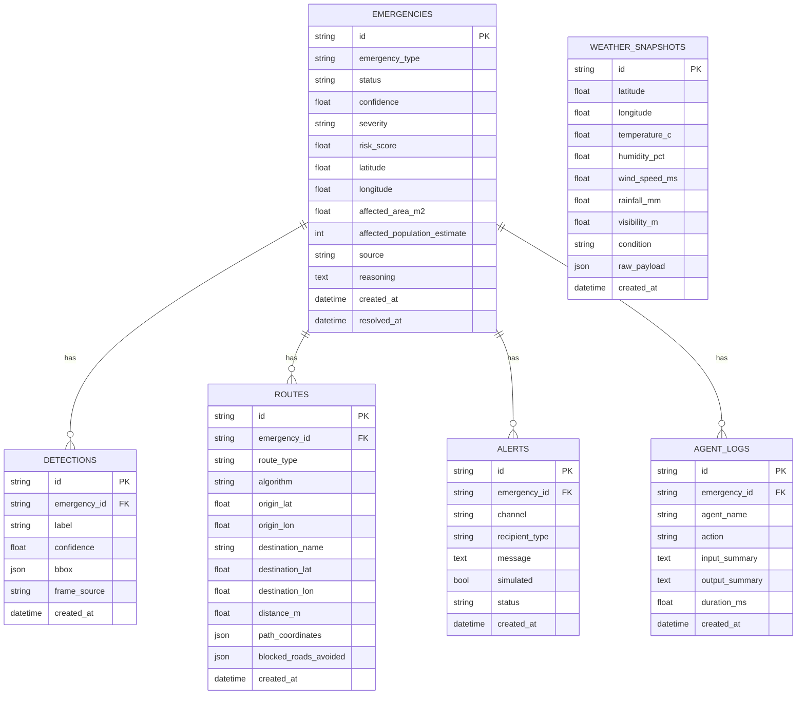

# AeroPlan-Agent — Architecture & Diagrams

## 1. System Architecture



## 2. Multi-Agent Workflow (LangGraph)



## 3. Sequence Diagram — Single Pipeline Run



## 4. Database ER Diagram



## 5. Agent Communication Diagram (Shared-State Blackboard)

```mermaid
flowchart TB
    subgraph State["AeroPlanState (shared TypedDict / blackboard)"]
        S1[latitude, longitude, source]
        S2[weather, satellite_context]
        S3[detections]
        S4[is_true_emergency, emergency_confidence, emergency_type]
        S5[severity, risk_score, affected_area_m2]
        S6[nearby_hospitals, safe_zones, blocked_roads]
        S7[primary_route, alternative_route, recommendations]
        S8[reasoning_chain, explanation]
        S9[alerts_dispatched, agent_logs]
    end

    MonitoringAgent -- writes --> S1 & S2
    VisionAgent -- reads --> S2
    VisionAgent -- writes --> S3
    VerificationAgent -- reads --> S2 & S3
    VerificationAgent -- writes --> S4
    RiskAgent -- reads --> S4
    RiskAgent -- writes --> S5
    GeospatialAgent -- reads --> S1 & S3
    GeospatialAgent -- writes --> S6
    PlanningAgent -- reads --> S5 & S6
    PlanningAgent -- writes --> S7
    ExplainableAgent -- reads --> S1 & S2 & S3 & S4 & S5 & S6 & S7
    ExplainableAgent -- writes --> S8
    AlertService -- reads --> S4 & S5
    AlertService -- writes --> S9
```



## 6. Risk Scoring Algorithm

```
base_score(emergency_type) ∈ {fire:55, flood:50, road_accident:45,
                               structural_collapse:65, obstruction:25, crowd_hazard:30}

score = base_score × emergency_confidence
score ×= wind_fire_multiplier(wind_speed)      # fire only, 1.0–1.6x
score ×= 1.25                                   # flood + rainfall > 15mm
score ×= (1 + min(log10(affected_area_m2+1)/20, 0.3))

severity = critical if score>=80
           high     if score>=55
           medium    if score>=30
           low       otherwise
```

## 7. Technology Stack Summary

| Layer | Technology |
|---|---|
| Multi-agent orchestration | LangGraph (StateGraph) |
| Vision model | YOLOv11 / RT-DETR (Ultralytics) + OpenCV heuristic fallback |
| Backend API | FastAPI + Pydantic |
| Database | PostgreSQL (SQLAlchemy ORM), auto-fallback to SQLite |
| Geospatial | OSMnx, NetworkX, GeoPandas, Shapely, Rasterio |
| Weather | OpenWeatherMap REST API |
| Satellite | NASA FIRMS, Sentinel Hub (Sentinel-2) |
| Frontend | Streamlit + Folium (Leaflet) + Plotly |
| Explainability | Structured reasoning chain + optional Claude LLM narrative |
| Deployment | Docker Compose (backend, dashboard, PostgreSQL) |
